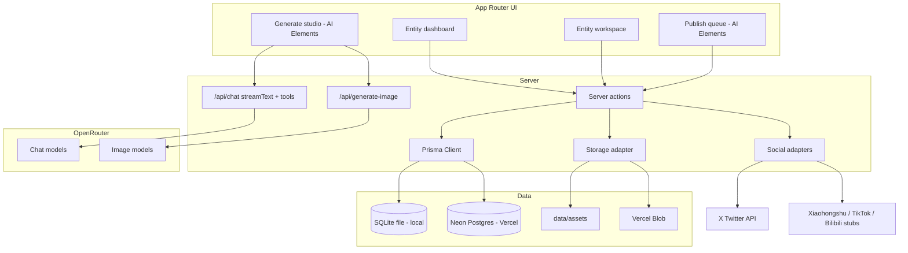

# VirtualInfluencer

Stop spamming one-off AI images. **VirtualInfluencer** is a local-first (and Vercel-ready) workspace for **consistent virtual entities**: a stable identity, a visual style bible, an asset library, a life trajectory, and a content queue that can actually publish.

Posting and streaming are the long-term holy grail. **Consistency is the product.**

## Workflow

1. Create an entity (name, bio, personality, visual style bible).
2. Upload canonical reference images.
3. Plan PG-13 life events (shopping, dining, travel, work, hobbies…).
4. Generate stills and captions grounded in the style bible + refs.
5. Queue drafts → schedule → publish (X is live when credentials exist; Xiaohongshu / TikTok / Bilibili are stubbed).

## Quickstart

```bash
npm install
cp .env.example .env.local
# set OPENROUTER_API_KEY in .env.local
npm run dev
```

Open [http://localhost:3000](http://localhost:3000). A demo entity **Lumen Park** (original character, not a real person) is seeded with sample life events.

| Script | What it does |
| --- | --- |
| `npm run dev` | Ensure env, generate Prisma Client, push SQLite schema, seed, start Next.js |
| `npm run build` | Production build |
| `npm run db:seed` | Re-seed (idempotent upsert by slug) |
| `npm run db:studio` | Prisma Studio |

## Stack

- **Next.js App Router** + TypeScript
- **shadcn/ui Lyra** (`components.json` style `radix-lyra`, Phosphor icons, JetBrains Mono)
- **AI Elements** + **Vercel AI SDK** (`ai`, `@ai-sdk/react`) for chat, tools, streaming, still generation UI
- **OpenRouter** via `@openrouter/ai-sdk-provider` (text) and the Image API (stills + reference images)
- **Prisma ORM 7** — SQLite locally, Neon Postgres on Vercel
- **Vercel Blob** for production assets; `data/assets` on disk for demos

## Architecture



The consistency profile (style bible + personality + locale) is compiled in `src/lib/prompt.ts` and injected into every generation call.

## Environment variables

Copy `.env.example`. Never commit secrets.

| Variable | Required | Purpose |
| --- | --- | --- |
| `DATABASE_URL` | Yes | `file:./data/dev.db` locally; Neon `postgres://…` on Vercel |
| `OPENROUTER_API_KEY` | For generation | Image + caption models |
| `OPENROUTER_TEXT_MODEL` | No | Default `openai/gpt-4.1-mini` (override in Generate UI) |
| `OPENROUTER_IMAGE_MODEL` | No | Default `google/gemini-3.1-flash-image-preview` |
| `BLOB_READ_WRITE_TOKEN` | Production | Vercel Blob. If unset, files are stored under `data/assets` |
| `APP_URL` | No | OpenRouter attribution header |
| `X_API_KEY` / `X_API_SECRET` / `X_ACCESS_TOKEN` / `X_ACCESS_SECRET` | For live X posts | OAuth 1.0a user context (text + media) |
| `X_OAUTH2_ACCESS_TOKEN` | Optional | OAuth 2.0 user token (text only) |
| `XHS_APP_KEY` / `XHS_APP_SECRET` | Stub | Xiaohongshu open platform |
| `TIKTOK_CLIENT_KEY` / `TIKTOK_CLIENT_SECRET` | Stub | TikTok Content Posting API |
| `BILIBILI_APP_KEY` / `BILIBILI_APP_SECRET` | Stub | Bilibili open platform |

Optional: `AI_GATEWAY_API_KEY` if you later route models through Vercel AI Gateway instead of OpenRouter.

## Deploy on Vercel

SQLite **does not persist** on Vercel serverless (ephemeral filesystem except `/tmp`). Use Neon + Blob:

1. Push this repo and [import it on Vercel](https://vercel.com/new).
2. Marketplace: add **Neon Postgres** (`DATABASE_URL`) and **Vercel Blob** (`BLOB_READ_WRITE_TOKEN`).
3. Set `OPENROUTER_API_KEY` (and any X tokens) in the project Environment Variables.
4. Framework preset: Next.js. Build command can stay `next build` (see `package.json`: it runs `prisma generate`).
5. After first deploy, initialize tables:

```bash
npx prisma db push
npm run db:seed
```

Or run those with the production `DATABASE_URL` locally. `scripts/prepare-prisma.mjs` switches the Prisma `provider` to `postgresql` when `DATABASE_URL` starts with `postgres`.

6. Redeploy. Open the deployment URL, edit **Lumen Park** or create a new entity.

## Social adapters

All publishers implement `SocialAdapter` in `src/lib/social/types.ts`.

| Platform | MVP status | How to go live |
| --- | --- | --- |
| **X / Twitter** | Live when user tokens are set | [X developer portal](https://developer.x.com) → OAuth 1.0a user tokens with tweet + media permissions |
| **Xiaohongshu (小红书)** | Stub UI | [open.xiaohongshu.com](https://open.xiaohongshu.com) — OAuth 2.0, note create with 1–9 images |
| **TikTok** | Stub UI | [Content Posting API](https://developers.tiktok.com/doc/content-posting-api-get-started) — OAuth, `video.publish` / inbox vs direct post |
| **Bilibili** | Stub UI | [openhome.bilibili.com](https://openhome.bilibili.com) — archive upload + live room APIs |

Failed or stubbed publishes are recorded per-item in `ContentItem.platformLog`. Stubs never pretend to have posted.

## Video / streaming (scaffold)

`VideoProject` and `StreamSession` models exist. The Studio page can storyboard an image sequence and write a stub file. **TODO:** ffmpeg (or a hosted encoder) to mux stills into mp4; YouTube Live / Twitch / Bilibili live ingest.

## Roadmap

- OAuth apps for Xiaohongshu, TikTok, Bilibili (not just env stubs)
- Real mp4 compose + optional talking-head / live avatar
- Streaming ingest to Bilibili, YouTube, Twitch
- Fine-tuning / IP-Adapter-style identity (out of scope for this MVP)
- Multi-user auth (this MVP is a single-operator workspace)

## License

MIT
